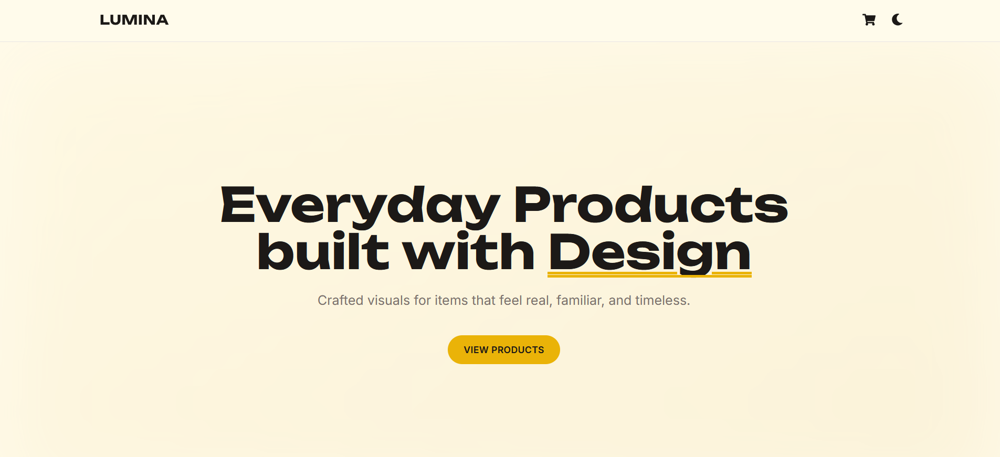
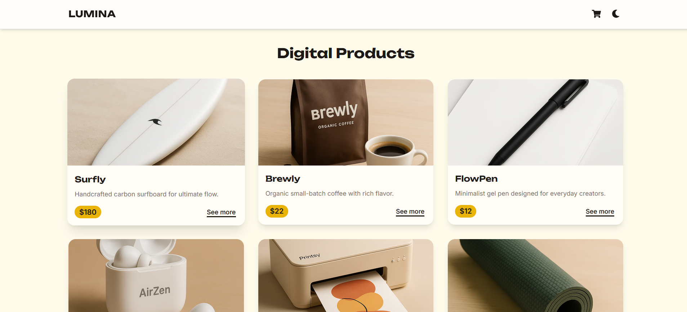
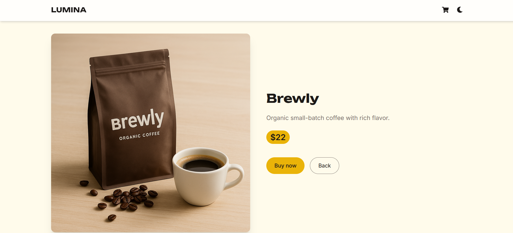

# LUMINA — Premium Digital Goods with Soul

> _Crafted interfaces. Real UX. Digital products that feel alive._

---

## 🧭 About LUMINA

**LUMINA** is more than a landing page — it’s a fully functional **e-commerce experience** for digital products, built as if launching tomorrow.

Designed with precision, care, and clarity in mind, it features:
- 🎨 Immersive hero with motion and scroll-based animations
- 🛍️ Interactive product grid with hover effects and route transitions
- 💳 Functional Stripe Checkout (test mode)
- ✉️ Contact form with real-time validation and EmailJS integration
- 🌗 Light/dark mode with system preference + persistence

> Built to showcase real frontend capabilities — not mockups.

---

## 🚀 Live Preview

👉 [https://lumina.quimromero.com](https://lumina.quimromero.com)

---

## ✨ Features

- ⚡ Scroll-based animations using Framer Motion
- 🎯 Fully responsive layout with keyboard accessibility
- 🛍️ Product detail routes with animated transitions
- 💸 Stripe Checkout (test mode, frontend-only)
- 📩 Validated contact form with Zod + EmailJS
- 🌓 Dark/light mode toggle with smooth transitions
- 🧼 Clean, scalable architecture built with intention
- 🎬 Page transitions, fade-ins, button feedback, and loader screen

---

## 🧠 Tech Stack

| Tech                     | Role                              |
|--------------------------|-----------------------------------|
| **React + TypeScript**   | Core framework                    |
| **Vite**                 | Build tool                        |
| **Tailwind CSS**         | Utility-first design system       |
| **Framer Motion**        | Animations + transitions          |
| **GSAP**                 | Scroll-based effects (planned)    |
| **Zustand**              | State management (optional scope) |
| **React Hook Form + Zod**| Form logic + validation           |
| **EmailJS**              | Contact form email integration    |
| **Stripe.js**            | Payment checkout (test mode)      |
| **React Router DOM**     | Page routing                      |

---

## 🗂 Project Structure

- `src/`
  - `components/` – UI blocks (Navbar, Hero, ProductCard, etc.)
  - `hooks/` – Custom hooks (smooth scroll, scroll-top reset)
  - `lib/` – Product data, validation schemas, checkout utils
  - `styles/` – Global Tailwind CSS config
  - `assets/` – Mock product images
  - `App.tsx` – Main routes + layout composition
- `public/` – HTML entry point, fonts, favicon
- `.env` – (optional) Stripe + EmailJS keys

---

## 🧪 Interactions & Motion

LUMINA focuses on **interface quality**, not just code:
- 🌀 Smooth scroll with scroll-triggered reveal animations
- 🔄 Hero section and products fade in naturally
- ⚡ Microinteractions on buttons, hovers, and route transitions
- ⌨️ Focus-visible states and keyboard-friendly navigation
- 📱 Fully responsive with mobile-first layout

---

## 📸 Screenshots

| Hero | Products | Product Detail |
|------|----------|----------------|
|  |  |  |

---

## 🧩 Notes

- 🧠 All code is handcrafted — no UI kits, no templates
- 🔍 Typography and motion tuned for clarity and presence
- 💡 Uses real data flow, payment redirect, and form validation
- 🎯 Built as a **freelance portfolio project**, ready for presentation

---

## 📬 Contact

Looking to hire a frontend developer who builds **real product experiences** with precision?

- 📧 quim@quimromero.com  
- 🌐 [https://quimromero.com](https://quimromero.com)

---

> _LUMINA is frontend done with soul —  
> built for users who feel design, not just see it._
